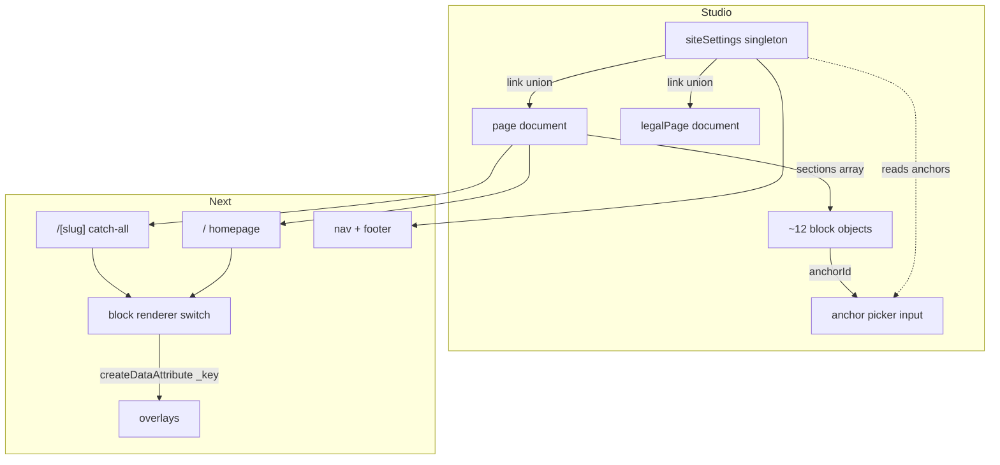

# feat: Sanity page builder

**Origin:** `docs/brainstorms/2026-07-18-sanity-page-builder-requirements.md`
**Prior round:** `docs/plans/2026-07-18-003-feat-sanity-visual-editing-plan.md` (U1–U9 shipped; its U10 is absorbed here as U13)
**Depth:** Deep — 18 units across 5 phases

---

## Summary

Turn the hardcoded relay section components into editable Sanity blocks composed by a `page`
document, add a `/[slug]` catch-all for new marketing pages, move nav and footer into a
`siteSettings` singleton, and flip visual-editing overlays on by default. Cut over via a
seeding script whose output is byte-compared against the pre-migration HTML.

---

## Problem frame

Presentation mode works but there is nothing to compose. Every homepage section is a
hardcoded React component whose copy is a JSX literal or an entry in
`components/relay/data.ts`. Changing a headline requires a deploy.

The prior round built for exactly this, and the foundation holds — the single fetch
chokepoint in `lib/sanity/lib/fetch.ts` means no query signature changes, and no dependency
upgrades are needed.

---

## Requirements traceability

| Origin | Covered by |
|---|---|
| R1 page composition | U8, U12, U13 |
| R2 route ownership | U8, U14, U15, U16 |
| R3 all chrome editable | U12, U13 |
| R4 data blocks with source toggle | U12 |
| R5 editable nav via singleton | U9, U15 |
| R6 anchor integrity | U7, U11, U12 |
| R7 compliance hardcoded | U15 |
| R8 page SEO editable | U7, U8 |
| R9 typed block union | U5, U13 |
| R10 overlays default-on | U13, U17 |
| R11 content-neutral cutover | U6, U16, U18 |
| R12 promote relay, delete rest | U1 |
| C1 single dataset | U18 |
| C3 no test framework | U2 |
| C4 layout robustness | U12 |
| C5 slug collisions | U8 |

---

## Key technical decisions

**KTD1 — Typegen config lives in `sanity.cli.ts`, not `sanity-typegen.json`.**
`sanity-typegen.json` is deprecated; the `typegen` block in `sanity.cli.ts` replaced it in
Sanity 4.19.0. The pinned 4.21.1 supports it. Repo root already has `sanity.cli.ts` with no
`typegen` block.

**KTD2 — Narrow the block union with `Extract<>`, not `Get<>` / `FilterByType<>`.**
Those helpers are v5-era and do not exist in `@sanity/codegen@4.21.1` — verified by grepping
`node_modules`, not assumed. The documented 4.x pattern is
`Extract<NonNullable<PAGE_QUERYResult>["sections"][number], { _type: "heroBlock" }>`.

**KTD3 — Typegen runs manually, not on watch.**
`typegen: { enabled: true }` and `--watch` require Studio 5.8.0+. On 4.21.1 the workflow is
`sanity schema extract && sanity typegen generate` re-run after query edits. Embedded Studios
cannot hook into `next dev` regardless.

**KTD4 — Discriminate the `link` union on a `stegaClean`ed field, in one resolver.**
Stega encodes author-entered content strings, so `linkType === "external"` silently fails in
draft mode. Clean at the resolver utility, never at each call site — per §1 of
`docs/solutions/best-practices/sanity-visual-editing-draft-mode-gotchas.md`.

**KTD5 — Data attribute paths use `_key`, never array index.**
`sections[_key=="abc123"]`, so GROQ must project `_key` on every section. Index-based paths
break the moment an editor reorders — which is the entire feature.

**KTD6 — Seeding follows the existing migration convention.**
`scripts/migrate-*.ts` established it: one `transaction()`, deterministic `_id`s,
`createOrReplace`, commit once, log the transaction id, npm alias, register in
`migrate-all.ts`. Deterministic ids are what make the seed re-runnable.

**KTD7 — Blocks are named for what they are, not how they look.**
`capabilitiesBlock`, not `threeColumnGrid`. Layout-named blocks calcify a design decision into
the content model and are the standard page-builder failure.

---

## High-level technical design



Data flow for a section click in Presentation: rendered block carries
`data-sanity="...path=sections[_key==\"K\"]"` → overlay maps it to the array item → form
focuses that item. Both the array container and each item need the attribute; the container
alone gives no per-section selection.

---

## Phase 0 — Foundation (no behaviour change)

### U1. Merge relay into components and delete dead code

**Goal:** One flat `components/` directory holding only what renders.

**Dependencies:** none — deliberately first. Every later unit touches these files; doing it
late means rewriting imports twice.

**Files:** `components/relay/*` → `components/*`; delete ~18 dead section files, plus
`components/navigation-client.tsx`, `components/footer-client.tsx`, and the shims
`components/navigation.tsx`, `components/footer.tsx`, `components/cta-section.tsx`. Update the
6 importers.

**Approach:** This is a **merge with name collisions, not a move.** `components/relay/hero.tsx`,
`faq.tsx`, `capabilities.tsx`, `footer.tsx`, `testimonials.tsx` all collide with dead files
already at `components/` top level. Order is therefore load-bearing:

1. Delete the dead files first (they are the collision source and have zero importers)
2. Move `relay/*` up
3. Rewrite the 6 import sites
4. Confirm `components/relay/` is empty and remove it

Verify zero-import status with a grep sweep before deleting, not from the survey alone.

**Execution note:** Pure move and delete. No test required — the guard is that the build
output is unchanged.

**Test expectation:** none — no behavioural change. `npm run build` must succeed and emit the
same route list and page count as before the unit.

**Verification:** `rg "components/relay"` returns nothing. Build succeeds. Rendered homepage
HTML is unchanged (this is a good dry run for the U6 harness).

---

### U2. Stand up Vitest

**Goal:** A test runner exists so later units can be test-first.

**Dependencies:** none.

**Files:** `vitest.config.ts`, `package.json` (scripts), `test/setup.ts`

**Approach:** Vitest + `@testing-library/react` + `jsdom`, per the ratified granite
`test-framework` convention. Add `test` and `test:watch` scripts. Path aliases must mirror
`tsconfig.json` or every `@/` import fails.

**Execution note:** Config only.

**Test expectation:** none — but the unit is not complete until one trivial smoke test runs
green, proving the harness works before anything depends on it.

**Verification:** `npm test` runs and passes.

---

### U3. Rotate the write token and harden the script client

**Goal:** No live credential on disk, and the guard that was supposed to catch it actually works.

**Dependencies:** none. Must land before U16, which is the first new write-client consumer.

**Files:** `scripts/sanityClient.ts`, `.env.local`

**Approach:** `scripts/sanityClient.ts` reads `process.env.SANITY_TOKEN || "sk1Dp28…"` — a live
write token as a fallback constant. The `if (!token)` guard beneath it is unreachable because
the fallback is always truthy. Rotate the token in Sanity manage, delete the fallback, let the
guard throw.

`scripts/` is gitignored and was untracked in `1d38336`, but the token remains reachable in
history via `4c3dc7f`. Rotation is not optional.

**Test expectation:** one scenario — importing the module with `SANITY_TOKEN` unset throws a
descriptive error rather than silently constructing a client.

**Verification:** Old token rejected by the API. `rg "sk[A-Za-z0-9]{20,}" scripts/` returns
nothing.

---

### U4. Split the schema into documents / objects / blocks

**Goal:** One file per type, so "what blocks exist?" is answerable by listing a directory.

**Dependencies:** U1.

**Files:** `lib/sanity/studio-schemas/` → `documents/`, `objects/`, `blocks/`, `index.ts` barrel.
Splits the existing 1,099-line `index.ts` into 11 document files.

**Approach:** Pure extraction — no schema changes in this unit, so any diff in behaviour is a
bug. Keep the existing export array shape so `sanity.config.ts` needs no edit. `blocks/` starts
empty; U12 fills it.

**Execution note:** Mechanical extraction. Do not "improve" schemas while moving them — that
makes the U5 typegen diff unreadable.

The `test-discipline` convention blocks new files under `lib/` without paired tests. This unit
carries an inline exception on each extracted file, because a before/after
`sanity schema extract` diff is stronger evidence of correctness than any unit test would be.

**That exception does not extend to U12.** Block schemas carry real behaviour — `Rule.min/max`
on process steps, `Rule.custom` asserting exactly one featured capability — and have real test
scenarios listed. Do not copy the U4 marker forward into `blocks/`.

**Test expectation:** none — structural. Guarded by U5's extracted `schema.json` being
identical before and after.

**Verification:** Studio loads, all 11 types present, no console errors.

---

### U5. Adopt GROQ typegen

**Goal:** Query results are typed, and a missing renderer case becomes a compile error later.

**Dependencies:** U4.

**Files:** `sanity.cli.ts`, `package.json`, `lib/sanity/queries.ts`, `schema.json` (generated),
`sanity.types.ts` (generated), `.gitignore`

**Approach:** Add the `typegen` block to `sanity.cli.ts` (KTD1) with explicit `path` globs —
defaults assume `./src`, which this repo does not use:

```
path: ["./app/**/*.{ts,tsx}", "./components/**/*.{ts,tsx}", "./lib/**/*.{ts,tsx}"]
schema: "schema.json"
generates: "./sanity.types.ts"
overloadClientMethods: true
```

Wrap all 25 query strings in `defineQuery`, each assigned to a **uniquely named** variable —
inline `client.fetch(groq\`…\`)` is silently skipped by typegen, and duplicate variable names
across files silently overwrite each other. Both failures are silent, so verify the generated
file rather than trusting the run.

Audit `lib/sanity/queries.ts` for surviving `!(_id in path("drafts.**"))` filters before
generating. The prior round removed 17; typegen would bake in any that remain.

**Test expectation:** one scenario — a known query's generated result type has the expected
field shape (a type-level assertion, guarding against silent `unknown` degradation).

**Verification:** `npm run typegen` produces no diff on a second run. `tsc --noEmit` passes.
`sanity.types.ts` contains named result types for all 25 queries, none of them `unknown`.

---

## Phase 1 — Baseline capture

### U6. Capture the pre-migration HTML baseline

> **⚠ ORDERING HAZARD — the single easiest thing to get wrong in this plan.**
> This unit must land **before U16** switches the homepage to render from the page document.
> Once that happens the baseline is unobtainable without a `git checkout` of the pre-migration
> tree. Nothing recovers it later.

**Goal:** A committed snapshot of current published HTML to diff the migration against.

**Dependencies:** U1, U2. Must precede U16.

**Files:** `test/fixtures/baseline/`, `scripts/capture-baseline.ts`, `package.json`

**Approach:** Build, then capture rendered HTML for `/`, `/blog`, `/templates`, and the policy
routes into committed fixtures. Normalise before storing — strip build ids, nonces, and hashed
asset filenames — or the diff is pure noise. Document exactly what is normalised; an
over-aggressive normaliser produces a harness that passes while the page is broken.

**Test expectation:** the capture is deterministic — running it twice on an unchanged tree
produces identical output.

**Verification:** Fixtures committed. Re-running produces no diff.

---

## Phase 2 — Core content model

### U7. Named objects: `seo`, `link`, and the anchor convention

**Goal:** Reusable objects exist before anything references them.

**Dependencies:** U4.

**Files:** `lib/sanity/studio-schemas/objects/seo.ts`, `objects/link.ts`,
`lib/sanity/lib/resolve-link.ts`

**Approach:** `seo` is promoted from the three inline duplicates on `blogPost`, `caseStudy`,
`workflowTemplate` — those switch to referencing the named type.

`link` is a discriminated union on a `linkType` string with `options.list` and radio layout
(string enum over booleans, per Sanity's schema rule):

| `linkType` | Fields |
|---|---|
| `internal` | reference → `page` \| `blogPost` \| `workflowTemplate` \| `legalPage` |
| `anchor` | reference → `page`, plus `anchorId` |
| `external` | `href` url, `openInNewTab` |

Two things that are easy to get wrong and both silent:

- Hide variants with `hidden: ({parent}) => …` — inside an object, `parent` is the object
  value, not the document.
- A hidden variant's `required()` still blocks publish unless the validator accounts for it.
  **`Rule.skip()` does not exist in `sanity@4.21.1`** — verified by grepping `@sanity/types`,
  not assumed. It is a v5-era addition, and the published docs showing it do not apply to this
  pin. The working equivalent is `Rule.custom((value, context) => …)` returning `true` when the
  variant is inactive. Verify behaviourally: assert each hidden variant's empty required field
  actually permits publish, rather than reading the code and concluding it does.

`resolve-link.ts` is the single resolver, and it `stegaClean`s `linkType` before switching
(KTD4). In client components import `stegaClean` from `@sanity/client/stega`, not `next-sanity`
— the narrower entry point avoids pulling server-only code into the bundle.

**Test scenarios:**
- `internal` resolves to `/{slug}` from the referenced doc
- `internal` → `legalPage` resolves to the policy path, not `/{slug}`
- `anchor` resolves to `/{pageSlug}#{anchorId}`
- `anchor` on the current page resolves to a bare `#{anchorId}`
- `external` returns href verbatim and sets `target="_blank"` with `rel="noopener noreferrer"` when `openInNewTab`
- **a stega-encoded `linkType` still resolves correctly** — the regression KTD4 exists to prevent
- a dangling reference returns null rather than throwing
- an unknown `linkType` returns null rather than throwing

---

### U8. `page` document with sections array and slug blocklist

**Goal:** The container the whole builder hangs off.

**Dependencies:** U7.

**Files:** `lib/sanity/studio-schemas/documents/page.ts`,
`lib/sanity/studio-schemas/objects/pageBuilder.ts`

**Approach:** `page` carries `title`, `slug`, `seo`, and `sections` (the `pageBuilder` array).
`pageBuilder` is its own named array type so `legalPage` and future types can reuse it.

Slug validation uses `rule.custom()` with a reserved-name set: `blog`, `templates`, `contact`,
`privacy`, `terms`, `cookies`, `refund-policy`, `delivery-policy`, `studio`, `api`, `_next`.
Also set `options.slugify` to prefix reserved values at generation time so authors rarely hit
the error.

Two caveats to record in the schema file itself:

- Custom validators **also run on `undefined`** unless `rule.optional()` is called — guard the
  empty case explicitly or publishing an empty draft throws a confusing error.
- **Studio validation is client-side only.** It does not run on API mutations, so it is not a
  route-collision guarantee. The Next.js resolver still has to behave (U14).

**Test scenarios:**
- each reserved slug is rejected with a message naming the conflict
- a valid slug passes
- uppercase / spaces / trailing hyphen rejected
- `undefined` slug produces the required-field message, not a crash
- `blogpost` (contains but does not equal a reserved word) is accepted — guards over-matching

---

### U9. `siteSettings` singleton and desk structure

**Goal:** Nav and footer become content, pinned to exactly one document.

**Dependencies:** U7, U8.

**Files:** `lib/sanity/studio-schemas/documents/siteSettings.ts`,
`lib/sanity/structure.ts`, `sanity.config.ts`

**Approach:** There is **no `singleton: true` schema option**, and `__experimental_actions` is
gone — do not reach for either. Three separate pieces:

1. Pin the id in structure: `S.document().schemaType("siteSettings").documentId("siteSettings")`
2. Filter it out of the auto-generated type list so it does not appear twice
3. Strip it from the global "+" menu via `document.newDocumentOptions`, and remove
   `duplicate` / `delete` via `document.actions` — both on the `document` key of
   `defineConfig`, not on the structure tool

`structureTool()` is currently called bare, so this is the first structure customisation in the
repo. Query with `*[_id == "siteSettings"][0]` — faster than filtering by `_type`.

**Fields:**

| Group | Fields |
|---|---|
| Brand | `logo` (image + `altText`), `logoLink` (`link`, defaults to `/`) |
| Navigation | `navLinks` (array of `link`), `headerCta` (`link`) |
| Footer | `footerColumns` (array of `{heading, links[]}`) |
| Global CTA defaults | `ctaHeading`, `ctaSubtitle`, `ctaButton` (`link`), `ctaFootnote` |

Compliance strip is **deliberately absent** — R7.

**Global CTA is a default, not a fixed value.** The contact CTA repeats across pages, so its
copy lives here and `ctaBlock` (U12) declares every corresponding field **optional**, falling
back to the singleton. A block dropped on a new page with no configuration renders the house
CTA; a landing page needing a different ask overrides just the fields it cares about.

The alternative shapes both fail: singleton-only means every page makes the identical ask, and
block-only means editing the same copy on ten pages until they drift apart.

Give `logo.altText` a real field rather than deriving alt text from the filename — it also
carries stega, so it doubles as the click-to-edit target for the logo (images encode nothing
themselves).

**Test scenarios:**
- the singleton query returns the pinned document
- nav links resolve through the U7 resolver in order
- an empty `footerColumns` renders the footer without crashing
- `logoLink` unset defaults to `/` rather than rendering a dead anchor
- a `ctaBlock` with no overrides renders the singleton's CTA copy
- a `ctaBlock` overriding only `ctaHeading` keeps the singleton's subtitle and button
- both unset renders the block's own empty state rather than a blank section

**Verification:** Studio shows exactly one Site Settings entry, no "create new" affordance, no
duplicate in the type list.

---

### U10. `legalPage` document

**Goal:** Policy pages become content; new ones need no code.

**Dependencies:** U7.

**Files:** `lib/sanity/studio-schemas/documents/legalPage.ts`

**Approach:** `title`, `slug`, `seo`, `lastUpdated`, `body` (Portable Text). Reuse the
`blogPost.content` member set as the pattern, minus `code` — legal copy does not need syntax
highlighting.

Worth noting the origin's open question here: `workflowTemplate.content` lacks the `code`
member that `blogPost.content` has, which looks unintentional. Not this unit's job, but the
asymmetry is visible while working in these files.

**Test scenarios:**
- a legal page renders its Portable Text body
- `lastUpdated` renders in the expected format
- an empty body renders the page shell without crashing

---

### U11. Anchor picker custom input

**Goal:** Selecting an anchor is a dropdown of real anchors, not free text.

**Dependencies:** U8, U9.

**Files:** `lib/sanity/studio-schemas/objects/link/anchor-input.tsx`

**Approach:** A custom input on `link.anchorId`. Reads the sibling page reference with
`useFormValue(["page", "_ref"])`, fetches `*[_id == $ref][0].sections[]{_key, anchorId}` via
`useClient`, renders a `@sanity/ui` `Select`, patches with `set(value)` / `unset()`.

One documented trap: `.withConfig()` returns a **new object every render**, so putting the
result in a `useEffect` dependency array causes an infinite loop. Wrap in
`useMemo(() => base.withConfig({…}), [base])`.

The referenced `_id` is the published id. Use `perspective: "drafts"` if anchors that exist
only on the draft should be selectable — they should, since an editor will typically be adding
the section and the link in the same session.

Fall back to a plain text input when no page is selected, rather than rendering an empty
disabled dropdown with no explanation.

**Test scenarios:**
- given a page with three anchored sections, three options render
- selecting an option patches `anchorId`
- clearing calls `unset()`, not `set("")`
- no page selected renders the text fallback
- referenced page with no anchored sections renders an explanatory empty state
- sections lacking `anchorId` are excluded from the list

---

## Phase 3 — Blocks

### U12. Author the block object types

**Goal:** ~12 block schemas matching the surviving components.

**Dependencies:** U4, U7, U8.

**Files:** `lib/sanity/studio-schemas/blocks/*.ts` (one per block)

**Approach:** Derive from `components/data.ts` — it is already a typed content model, so this is
closer to transcription than design. Name blocks for what they are (KTD7).

Every block carries `anchorId`, auto-generated from the block title with manual override, and
a `preview` with `title` (content), `subtitle` (the block type name), and `media` falling back
to a `@sanity/icons` icon. The subtitle is what makes collapsed rows readable when reordering —
without it every row reads "Untitled".

Data blocks carry the `sourceMode` enum from R4:

| Mode | Behaviour |
|---|---|
| `auto` | query the collection (e.g. `showOnHome`), matching today |
| `manual` | editor picks referenced documents in order |

Layout guards from C4, as schema validation:

| Block | Rule |
|---|---|
| `processBlock` | `Rule.min(2).max(4)` on steps |
| `capabilitiesBlock` | `Rule.custom()` asserting exactly one `featured` item |

`resultStats` fields get a `description` naming the n8n dashboard source and date, per the
origin's real-numbers convention.

Nested arrays (capability `snippet[]`, process steps) must be **wrapped in an object type** —
bare nested arrays are unsupported.

**Test scenarios:**
- `processBlock` with 1 step fails validation; 2 and 4 pass; 5 fails
- `capabilitiesBlock` with 0 or 2 featured items fails; exactly 1 passes
- `sourceMode: auto` resolves to the collection query
- `sourceMode: manual` resolves to the picked documents **in the editor's order**, not document order
- `manual` with an empty pick list renders the block's empty state rather than crashing
- every block schema exposes `anchorId`
- every block's `prepare` returns a non-empty subtitle

---

### U13. Block renderer, typed union, and data attributes

**Goal:** Sections render in array order, are click-selectable, and a missing case fails to compile.

**Dependencies:** U5, U12. Absorbs U10 of the prior plan.

**Files:** `components/page-builder.tsx`, `components/blocks/*.tsx`,
`lib/sanity/lib/data-attribute.ts`

**Approach:** A `switch` on `_type` over the generated union, narrowed with `Extract<>` (KTD2),
with an exhaustiveness check via a `never`-typed default so an unhandled block is a compile
error rather than a blank gap.

Data attributes need **both levels** — container and item:

```
container: path "sections"
item:      path `sections[_key=="${section._key}"]`
```

Item-level is what maps a click to the right array item; the container alone gives no
per-section selection. Paths use `_key`, never index (KTD5) — GROQ must project `_key` on every
section or this silently produces wrong targeting after any reorder.

There is **no `defineDataAttribute` helper** — it does not exist in any installed package. Build
a small factory holding `{projectId, dataset, baseUrl}` and spread per call.

`page-builder.tsx` must be `"use client"` for `useOptimistic` to drive live reordering.

Per-block `usePresentationQuery` (confirmed present in `next-sanity@11.6.10`) so each block
resolves its own data in Presentation rather than the whole page refetching. Designed in now
because retrofitting across 12 blocks later is materially more expensive.

One documented overlay trap: a stega-encoded string that fills the entire item element steals
the overlay from its parent array item. Fix with `stegaClean()` on that string or with padding
on the container.

**Test scenarios:**
- blocks render in array order
- reordering the array reorders the output
- each rendered section carries a `data-sanity` attribute containing its own `_key`
- the container carries the `sections` path attribute
- an unknown `_type` renders nothing and does not throw
- adding a block type without a renderer case fails `tsc` — the exhaustiveness guard
- `anchorId` renders as the section's `id`
- a section without `anchorId` omits `id` rather than emitting `id=""`

---

### U14. `/[slug]` catch-all route

**Goal:** New pages publish without a deploy, without shadowing real routes.

**Dependencies:** U8, U13.

**Files:** `app/[slug]/page.tsx`

**Approach:** Standard document route: `generateStaticParams`, `generateMetadata` from the
`seo` object, `notFound()` for unknown slugs.

`generateStaticParams` **must** pass `forcePublished` and `stega: false`. The option already
exists in `lib/sanity/lib/fetch.ts`. This matters more here than on `/blog/[slug]` because a
catch-all at the site root competes with real routes — a draft-only page emitting a build-time
route at `/` is a live 404 for something that should not exist publicly.

`generateMetadata` pins `stega: false` so zero-width characters never reach `<title>` or meta.

Next resolves static segments before dynamic, so `/blog` wins over `/[slug]` by default. The
U8 blocklist is defence in depth, not the primary mechanism.

**Test scenarios:**
- a published page renders at its slug
- an unknown slug 404s
- `generateStaticParams` omits draft-only pages
- `generateStaticParams` output contains no zero-width characters
- metadata comes from `seo` and falls back to `title` when `seo` is empty
- a page whose slug matches an existing static route does not shadow it

---

## Phase 4 — Wiring

### U15. Nav, footer, and listing page headers from Sanity

**Goal:** Chrome becomes editable; compliance stays locked.

**Dependencies:** U9, U7.

**Files:** `components/nav.tsx`, `components/footer.tsx`, `app/layout.tsx`,
`app/blog/page.tsx`, `app/templates/page.tsx`

**Approach:** Fetch `siteSettings` in the root layout through `fetchQuery`. The prior round
verified that calling `draftMode()` in the root layout does **not** de-opt static rendering —
`/` stayed static with its 30m revalidate — so this is safe.

Nav and footer links render through the U7 resolver. The Wise compliance strip stays a
hardcoded literal in `footer.tsx` with a comment naming it as a payment-provider requirement
(R7).

Listing page headers become an editable header on the respective listing documents, not full
page-builder pages — blog and templates keep their bespoke routes (R2).

**Test scenarios:**
- nav renders links from `siteSettings` in order
- footer columns render with headings
- **the compliance strip renders identically regardless of `siteSettings` content** — the R7 guard
- missing `siteSettings` renders nav and footer empty rather than crashing the layout
- listing headers render from Sanity with a fallback when unset

---

### U16. Homepage migration and seeding script

> **⚠ Depends on U6 having already captured the baseline.** Verify the fixtures exist before
> starting this unit.

**Goal:** The homepage renders from a `page` document, with its content seeded from code.

**Dependencies:** U6, U13, U15. **U3 must have landed** — this is the first new write-client consumer.

**Files:** `scripts/seed-pages.ts`, `scripts/migrate-all.ts`, `package.json`,
`app/page.tsx`

**Tracking:** `scripts/` is gitignored (contents, not the directory), with `!/scripts/seed-*.ts`
negated so seeding scripts are committed. The seed is the durable record of pre-migration
homepage copy and the reproducibility path for a fresh dataset — a gitignored file serves
neither. The existing ten `migrate-*.ts` files stay untracked; auditing them for credentials is
separate work.

**Approach:** Follow the established migration convention exactly (KTD6) — one `transaction()`,
deterministic `_id`s (`page-home`, `siteSettings`), `createOrReplace`, single commit, log the
transaction id, `migrate:pages` npm alias, registered in `migrate-all.ts` in dependency order
(`siteSettings` and referenced docs before `page`).

The script reads `components/data.ts` exports and the JSX literals and constructs the section
array. Deterministic ids are what make it re-runnable — a second run is a no-op, not a duplicate.

The script must **not** route through `fetchQuery`: no request context, and it throws.

`app/page.tsx` becomes a thin wrapper fetching `page-home` and rendering `<PageBuilder />`.

**Test scenarios:**
- the seed produces a page document whose section count matches the current homepage
- running the seed twice produces no second document — the idempotency guard
- every seeded section has a unique `_key`
- every seeded section has an `anchorId` matching the current hardcoded section ids
  (`services`, `process`, `results`) — the R6 regression that would silently break nav
- the seeded document validates against the schema

---

### U17. Overlays default-on, and verify the embedded-Studio trap

**Goal:** Click-to-edit is on, and the Comlink connection actually works.

**Dependencies:** U13.

**Files:** `app/layout.tsx`, `.env.local`, possibly `app/(site)/` route group

**Approach:** Flip `NEXT_PUBLIC_SANITY_VISUAL_EDITING` to default-on, retained as a kill switch,
active in production draft mode.

**Verify-first on the isolation trap.** Sanity's docs warn that rendering `<VisualEditing />`
from the root layout when the Studio is a route in the same app attaches Comlink to the
Studio's own iframe context and breaks the connection. This repo has an embedded Studio at
`/studio` and the prior round wired the layout that way.

The symptom is specific: Presentation reports *"Unable to connect to visual editing"* and
*"Documents on this page"* comes up empty, **with nothing in the logs**. Reproduce that
signature before restructuring anything.

If it reproduces, split `/studio` into its own route group so it no longer inherits the root
layout. If it does not, add a comment recording that it was checked and leave routing alone.

Keep the two gates separate — `<VisualEditing />` is the bridge, stega is the click targets.
Conflating them produces exactly the symptom above. Also: `useIsPresentationTool()` returns
`null` while checking, so guard with `!== false`, not truthiness — the comlink handshake can
take up to 3s.

Do **not** "fix" the intentionally absent `browserToken` in `lib/sanity/live.ts` while working
here. A leaked browser token reads every draft and can mint unlimited preview links.

**Test scenarios:**
- published anonymous render contains no zero-width characters
- `<VisualEditing />` does not mount for anonymous visitors
- the kill switch env var disables overlays without disabling the bridge

**Verification:** Open Presentation, confirm the document list populates and clicking a
section focuses its array item.

---

## Phase 5 — Cutover and regression

### U18. Regression harness and dataset cutover

**Goal:** Prove the migration is content-neutral, then publish with near-zero exposure.

**Dependencies:** all prior units.

**Files:** `test/regression/html-baseline.test.ts`, `test/regression/leak-scans.test.ts`

**Approach — harness.** Diff post-migration HTML against the U6 fixtures. Byte-identical output
proves content neutrality. Plus the two leak scans from the existing solutions doc, which are
cheap and guard exactly the regression overlays introduce:

- zero-width characters in `.next/server/app/**/*.html` must be **0**
- `SANITY_API_READ_TOKEN` occurrences in `.next/static` must be **0**

**Approach — cutover.** One dataset serves dev and production (C1), so sequence deliberately:

1. `npx sanity dataset export production` — the restore point, non-negotiable
2. Run the seed writing **drafts only** — invisible to anonymous visitors
3. Verify through Presentation
4. Publish

Draft-first shrinks the exposed window from the whole seeding run to the publish action.
Downtime is acceptable per C1, but there is no reason to spend it.

**Test scenarios:**
- homepage HTML matches baseline byte-for-byte after normalisation
- policy page HTML matches baseline
- zero-width scan returns 0 across all prerendered HTML
- read token scan returns 0 across `.next/static`
- the harness **fails loudly on an intentional single-character content change** — a harness
  that cannot fail is not a harness, and an over-aggressive normaliser is the likely cause

**Verification:** `npm run build` succeeds, page count matches the pre-change build plus the new
routes. Anonymous browsing shows no stega. Presentation reorder updates the preview.

---

## Scope boundaries

**In scope:** everything in the 18 units above.

**Open from execution**

- `ctaBlock.secondaryCta` has no `siteSettings` fallback. `cta.tsx` renders two CTAs — a primary
  button and an "or send us a message" text link — but the global CTA defaults model only the
  primary. The block field exists and works; it just always has to be filled per-page. Either
  add a matching default to `siteSettings` or accept it. Surfaced by the block agent rather
  than silently dropping the second link's copy.
- Hero's workflow-diagram mock terminal and CTA's terminal chrome stay hardcoded. Decorative and
  tightly coupled to bespoke animated components. Reasonable, but it means those two sections
  are not *fully* editable, which is worth knowing against R3.
- `page.ts` and `legalPage.ts` duplicate the flat-slug format regex verbatim. A shared
  `validateFlatSlugFormat` is the obvious extraction now both files are stable.

**Deferred to follow-up work**
- `granite-sanity-page-builder` skill and the checkable conventions — deliberately after build
  and test, so they carry real lessons rather than guesses
- `CONCEPTS.md` entries for `page`, section block, `siteSettings`, `legalPage`. Worth adding as
  the work lands — the existing Portable Text entry already claims the "ordered list of typed
  blocks" phrasing, so a page-builder section block needs explicit disambiguation or the two
  will be conflated
- `workflowTemplate.content` missing its `code` member (origin Q1) — visible during U10, but a
  separate fix
- **Upgrading `sanity` 4 → 5+.** Deliberately out of scope here (C2), but the case is building
  and this project is generating the evidence. Scope it as its own piece of work rather than
  mid-build:

  | Friction hit | Consequence on 4.21.1 |
  |---|---|
  | `Rule.skip()` absent | Hidden-variant validation goes through `Rule.custom` instead |
  | `Get<>` / `FilterByType<>` absent | Block union narrows via `Extract<>` by hand |
  | Typegen `enabled: true` and `--watch` need 5.8+ | Manual `extract && generate` after every query edit |
  | TypeGen GA is 5.10.0 | Currently on the pre-GA workflow |
  | Embedded Studio marked "Not Recommended" | No auto-updates, no typegen watch, 10–30x slower builds |

  None of these blocked the build, but three of five are "the documented answer does not exist
  in this version" — which is the shape of a pin that has drifted from its docs. The upgrade
  path is `sanity` 4→6 plus `@sanity/vision`, `@sanity/code-input` and a React patch bump, so
  it carries real risk and deserves its own plan.

- Migrating the Studio out of the Next.js app. Sanity's `nextjs` rule now explicitly marks
  embedded Studios "Not Recommended" (no auto-updates, no typegen watch, 10–30x slower builds),
  and `autoUpdates: true` in `sanity.cli.ts` does nothing for an embedded Studio. Direction of
  travel, not this project

**Out of scope**
- Canvas drag-and-drop
- Generic theme layer, block-library package, design-token abstraction
- Editable contact form
- Dependency upgrades

---

## Risks

| Risk | Mitigation |
|---|---|
| Baseline captured after homepage migration | U6 gated before U16, flagged twice in this doc |
| Over-aggressive normaliser hides real regressions | U18 tests the harness can fail on a 1-char change |
| Index-based data attributes break on reorder | KTD5; U13 test asserts `_key` presence |
| Stega breaks `linkType` switching in draft mode | KTD4; U7 has an explicit stega-encoded test |
| Embedded-Studio Comlink trap | U17 reproduces before restructuring |
| Seed produces duplicates on re-run | Deterministic `_id` + `createOrReplace`; U16 idempotency test |
| Nav anchors silently break post-migration | U16 asserts seeded `anchorId`s match current hardcoded ids |
| Typegen silently degrades to `unknown` | U5 verifies the generated file, not just the exit code |

---

## Execution batching

Units are dispatched to sub-agents, parallel within a batch, serial between batches. Batches
derive from the dependency graph — a unit may start once every unit it depends on has landed.

| Batch | Units | Note |
|---|---|---|
| A | U1, U2, U3 | Fully independent. U1 touches `components/`, U2 root config, U3 `scripts/` — no file overlap |
| B | U4, U6 | U4 needs U1; U6 needs U1 + U2 |
| C | U7 | **U5 moved out.** U7 promotes `seo` to a named type, changing the `schema.json` that typegen consumes |
| D | U8, U10 | Both need U7, disjoint files |
| E | U9, U12 | Both are schema work. U12 is the fan-out point — split by pattern (chrome blocks vs data blocks), not one agent per block, so each agent owns a coherent convention |
| E2 | U5 | **Moved last among schema work.** Typegen is manual on 4.21.1 (KTD3), so it must be re-run after every schema change. Running it before U9 and U12 would generate a `sections` type of `null` — an empty `of: []` extracts as `{"type": "null"}` — and stale types twice over. One run against a settled schema instead |
| F | U11, U13, U15 | U13 is the critical path |
| G | U14, U17 | Both need U13 |
| H | U16 | Serial — the cutover, and it touches `app/page.tsx` |
| I | U18 | Serial — validates everything |

Two batching hazards worth respecting:

- **File collisions beat logical independence.** Units that don't depend on each other can still
  both edit `sanity.config.ts` or `package.json`. U5 and U9 both touch config; U2, U3, U5 and
  U16 all touch `package.json`. Serialise on the file, or give colliding agents separate
  worktrees.
- **U12 is the natural fan-out point.** Twelve block schemas are genuinely independent of one
  another and derive from a shared, already-typed source in `components/data.ts`. That is the
  one place where per-item parallelism pays off rather than adding coordination overhead.

---

## Notes

Commits are checked against `~/granite/knowledge/conventions/nextjs.md` via the session hook and
pre-commit tier, live in this repo as of 2026-07-18. CI tier is disabled. Audit is currently clean.

Prior-round context worth re-reading before starting:
`docs/solutions/best-practices/sanity-visual-editing-draft-mode-gotchas.md` governs U5, U13, U14,
U17 and U18 directly.
